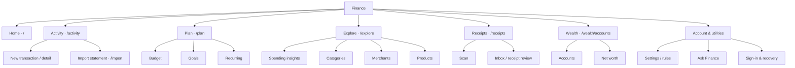
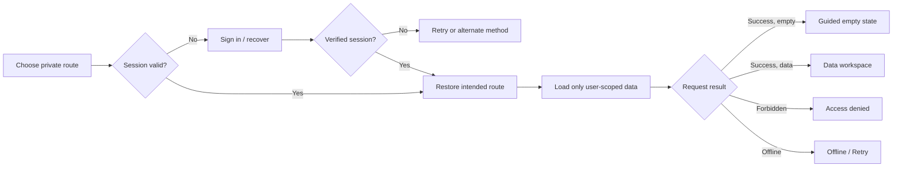

# P24 — Information Architecture & Interaction Blueprint

**Phase:** P24 · 8 October 2026  
**Status:** **Design/interaction specification ready for P25 and P27 implementation. No runtime navigation or UI changes in this phase.**  
**Inputs:** [P23 source audit](../P23_UX_VISUAL_AUDIT.md), [P23 screenshot audit](../P23_VISUAL_CAPTURE_RESULTS.md), current `FinanceApp.tsx`, `AppShell.tsx`, Finance Core/Supabase runtime, receipt and ledger services.  
**Machine-readable source:** [route-contract.json](../design/p24/route-contract.json)  
**Task acceptance matrix:** [journey-contract.json](../design/p24/journey-contract.json)  
**Companion artifacts:** [wireframes](P24_LOFI_WIREFRAMES.md), [implementation handoff](P24_IMPLEMENTATION_HANDOFF.md)

## 0. Product outcome and design constraints

Finance must help a person know **what they have, what they spent, what is due, what they can allocate, and where a number came from.** The interface must remain predictable and fast for repeated daily tasks and analytical exploration.

### Non-negotiable principles

1. **Money first:** numbers, dates, counterparties and evidence take precedence over dashboard slogans, marketing prose and decorative cards.
2. **Tasks, not modules:** primary nav expresses goals; modules like rule engines, imports, receipt OCR and AI are subordinate.
3. **Ledger integrity:** posted ledger is authoritative for spending; receipt evidence does not post a second expense; forecasts, valuations and plans are labelled as distinct models.
4. **Mobile and desktop are purpose-built:** same information architecture, distinct interaction density. Mobile uses accessible full pages for complex tasks and a persistent Scan action.
5. **Every error has recovery:** do not expose internal RPC/function names to the end user; do not present errors as empty datasets.
6. **Accessibility and privacy are features:** keyboard and focus handling, state labels, contrast, accessible chart data and user-scoped receipt drafts.
7. **No forced AI:** optional contextual explanations, deterministic answers and core workflows work without a ChatGPT subscription.
8. **Visual direction not chosen yet:** P25 compares three genuinely different candidates with realistic, explicitly synthetic fixture data. This phase locks structure and interaction semantics, not colors/layout aesthetics.

## 1. Navigation model

### Six desktop destinations

| Primary | Default path | User question answered | Subpages / context | Key action |
| --- | --- | --- | --- | --- |
| **Home** | `/` | How am I doing and what needs attention? | Current month, spending pace, upcoming commitments, unmatched evidence | Review attention / add entry |
| **Activity** | `/activity` | What happened to my money? | Filtered transaction ledger, detail, imports, account context | New transaction |
| **Plan** | `/plan` | Where can my money go? | Budget, `/plan/goals`, `/plan/recurring` | Allocate / adjust |
| **Explore** | `/explore` | Why did it change? | Insights, categories, merchants, products, cost trends | Filter / compare |
| **Receipts** | `/receipts` | What can I prove, correct and reconcile? | Inbox, scan, OCR review, matches | Scan |
| **Wealth** | `/wealth/accounts` | What is my complete position? | Accounts, detail, net worth | Reconcile |

**Secondary utilities:** Imports at `/import` (also reachable from Activity), Rules at `/settings/rules` (also from merchant/category context), Ask Finance at `/ask` (also via explain links), Settings at `/settings`. These must not occupy a global primary-navigation section.

Desktop sidebar shows six primary destinations, with at most one short contextual subnav attached to the **active** section. Hide inactive subnavigation; no repeated independent six-group feature inventory.

### Five mobile actions

| Bottom item | Opens | Rationale |
| --- | --- | --- |
| Home | `/` | Immediate financial position |
| Activity | `/activity` | Daily ledger |
| **Scan** (emphasized action) | `/receipts/capture` | Fast camera/file capture |
| Plan | `/plan` | Budget and commitments |
| Explore | `/explore` | Spending investigation |

**Required secondary affordance:** a permanently discoverable, labelled topbar `More`/account entrypoint opening a navigational **menu**, not a fake primary modal tab. This menu contains Receipts, Accounts & wealth, Imports, Rules, Ask and Settings & account. Receipts and Wealth must also be linked contextually from Home, Activity and Explore. The More menu must work while signed out.

**Do not show six desktop buttons and six mobile buttons merely for parity.** Preserve important destinations using an explicit secondary hierarchy.

### Hierarchical sitemap

Sitemap is **structural**. The specific left-menu width, colors, component styling and illustrations are chosen in P25.

## 2. Route, URL and history decisions

**Decision: migrate from hash routes to canonical pathname routes in P27.** The current `FinanceApp` and `AppShell` use inconsistent imperative `history.replaceState`, `window.location.hash` and React-only state; they must be replaced by one coordinated route store. Existing hash URLs remain accepted as aliases, without breaking public API/MCP endpoints.

A pathname migration on Vercel **requires an explicit client-route rewrite/fallback**. Current `vercel.json` contains policy/OAuth rewrites but does not declare a general SPA rewrite. P27 must add specific app-route rewrites or a carefully scoped fallback that does not intercept `/api/*`, `/.well-known/*`, `/privacy`, `/terms`, `/support` or assets. Verify direct refresh on a nested route in production preview before cutover.

**Navigation semantics (required):**

- User-initiated destination changes produce **new history entries** (`pushState` or library equivalent).
- Alias normalization, canonical default route and post-auth redirect normalization **replace** current entry; do not pollute Back.
- Browser Back/Forward restores route, query parameters, filters and meaningful scroll/focus. No hidden divergence between URL and visible React view.
- Direct-link to a detail route works on cold start, when logged in or signed out; a signed-out user returns there after successful authentication.
- Transaction/receipt detail and financial edit flows have stable URLs. On desktop they may be shown as a synchronized detail column; on mobile they are full pages. Never implement a deep-linked detail as an unaddressable transient popover.
- The `/activity/new` desktop entry may be a side sheet; mobile uses a full-page form. The sheet state belongs to a URL and Close restores a known meaningful previous page.
- Unknown/invalid route shows an understandable Not Found state, `Back to Home`, and search. Do not show an empty app or raw route ID.
- Route titles are distinct and meaningful; update `document.title` and focused page heading on navigation.
- Unsaved financial forms prompt on destructive navigation; browser Back is not silently blocked for read-only flows.

**Legacy aliases:** all 17 old `#key` values in [machine-readable route contract](../design/p24/route-contract.json) must remain valid for at least one full stable release. Critical special links:
- `/#activity?q=REWE` → `/activity?q=REWE`
- `/#products?product=<id>` → `/explore/products/<encoded-id>`
- `/#scan` → `/receipts/capture`
- `/#budget` → `/plan`

Never lose a supported query parameter while normalizing. Validate dynamic path IDs and percent-encode them; do not interpolate arbitrary user input into path or redirect.

### Query state

| Path | Shareable URL state | Local-only state |
| --- | --- | --- |
| `/activity` | `q`, `from`, `to`, `merchant`, `kind`, `account` | Active row hover, transient keyboard focus |
| `/plan` | `period`, `category` | Unsaved allocation editor |
| `/explore` | `period`, `compare` | Chart hover, tooltips |
| `/receipts` | `status`, `q` | Camera permission prompt, transient upload progress |
| `/activity/new` | `type`, safe `returnTo` | Draft contents until saved |
| `/sign-in` | validated `next` as same-origin relative route only | OAuth state, tokens and one-use return intent |

Query parameter names must be consistent and tested for invalid dates, values, duplicates and clear-filter behavior. **No private financial values or tokens in URLs**. Transaction IDs in access-controlled deep links are identifiers only, never access credentials.

## 3. Authentication, loading and error state matrix

**A central session boundary is required before any private page mounts data-fetching effects.** The current P23 failures (`finance_initialize` permission denied, false `No merchants found`) are directly caused by the absence of a coherent signed-out app state.

| Session / data state | User-facing experience | Available action | Data request rule |
| --- | --- | --- | --- |
| Restoring session | Neutral brief shell / skeleton with correct destination context | Wait, then Retry if failed | Do not call private Finance RPCs while identity is unknown |
| Signed out | Clear `Sign in to continue` surface, explaining what the destination needs | Google, email link, Home, privacy | No private RPC attempt, no misleading empty finance data |
| Signed in, first use | Focused setup checklist for first account, transactions and budget | Add account / import / begin empty | Can fetch account-scoped init; no fabricated demo totals |
| Signed in, populated | Normal finance tools | All authorized actions | Ledger and Finance read models scoped to verified identity |
| Session expired | Inline notice without exposing backend exception; preserve recoverable draft safely | Sign in again | Stop retries/financial writes until re-authenticated |
| Forbidden | `You don't have access to this item`; detail maybe no longer in account | Go Back / Home / Support | Never reveal other-user finance metadata |
| Network offline | Existing verified read state may be shown with stale indicator; writes remain queued or disabled per documented semantics | Retry | Never claim a write succeeded without confirmation |
| Service unavailable | `Finance is temporarily unavailable` | Retry, return to previous screen | Preserve typed work locally where safe; expose correlation ID only when appropriate |
| True empty data | Purposeful blank-state guidance, e.g. `Add your first account` | Add/import | Only after a successful zero-row response |
| Validation error | Field-level accessible message, input unchanged | Correct fields | No mutation |
| Server conflict / duplicate | Clear conflict explanation and safe review path | Review or cancel | No uncontrolled double posting |

**Auth contract:**
1. Finance continues using the existing **THIEPN Core/Supabase** authenticated user and row-level ownership. Do not create a second account silo.
2. Verify the OAuth and email redirects permitted by production Supabase configuration before implementing `/auth/callback`. The present Settings links redirect to `/#overview`; migration must preserve backwards compatibility.
3. Only trusted, same-origin, root-relative allowlisted destination paths may be restored. Store one-use `next` in session storage with a short TTL (10 minutes); do not accept protocol-relative `//host`, `javascript:`, external origins, `/api` or `/.well-known` targets.
4. Clear the stored return intent after successful restore or expiry; strip OAuth callback tokens, code and error parameters from the URL. Do not record sensitive callback payloads in analytics/logs.
5. Sign-out clears active financial views and caches immediately. Explicitly explain the treatment of device-local receipt drafts; do not silently delete them or let a new account see the prior account's drafts.
6. `401/session missing` routes to sign-in; `403/row denied` shows access denied; transport errors offer Retry. Error classification must not rely on English substring matching alone where typed RPC errors are available.

## 4. Universal interaction patterns

### Global header

- Use a **compact label** (`Activity`, `Budget`, `Receipts`) plus period/active account if relevant; no two-line oversized welcome or one-sentence hero.
- One **contextual primary action** per page (`New transaction`, `Scan`, `Adjust budget`), optional secondary actions, and a persistent account/More control.
- **Global search must be honest:** until multi-domain indexing ships, label it **`Search transactions and receipts`** and open Activity scope. Merchants, products and categories get dedicated Explore filters. No fake multi-domain placeholder.
- Ask Finance is secondary contextual analysis (`Explain this change`), not a default call-to-action on every screen.

### Financial controls

- Native keyboard-first rows and action semantics; tabular figures, currency code where needed, explicit period for totals.
- A click on a chart segment must filter to traceable source transactions or clearly explain why drill-down is unavailable.
- Account balances, net worth, spending, future obligations and remaining budget cannot share indistinguishable summary formats.
- Show source freshness and pending/uncategorized data when they affect amount interpretation.
- Destructive or ledger-changing actions require reversible, checked, or reviewed flows according to risk. No optimistic definitive success after request submission.
- Status is communicated by text, icon and accessible names, never color alone.
- Receipt OCR is **suggestive evidence**, not automatically authoritative purchase or ledger data.

### Responsive behavior

| Dimension | Desktop (>=1024px) | Tablet (600–1023px) | Mobile (<600px) |
| --- | --- | --- | --- |
| Global nav | Six-item task sidebar; active contextual subnav | Compact rail or header nav | Five-item persistent bottom bar + labelled More menu |
| Transaction ledger | Dense ledger with optional detail column | Responsive two-pane or full row | Large touch rows, detail on a full page |
| Receipt workbench | Evidence image and editable values side-by-side | Stacked/side-by-side depending available space | Stepwise full-screen evidence + correction |
| Budget | Expandable category allocation table | Dense single workspace | Category sections and sticky available amount |
| Explore | Chart + breakdown + drill-down | Compact chart + table | Direct chart/table switcher, tap-first filters |
| Critical actions | Clear action in header or keyboard shortcut | In context | Reachable near top or fixed bottom action with safe-area padding |

**320px device width:** no clipped totals, controls or actionable text; amount figures can wrap as complete units in constrained layouts, never ellipsize a number without an accessible full value.

### Accessible navigation

- Prefer semantic `<a href>` for destinations, preserving copy-link, open-in-new-tab and native keyboard behavior.
- Use a single main landmark; distinguish desktop vs mobile nav landmarks by accurate labels. Mark current link `aria-current="page"`.
- On meaningful SPA navigation announce updated title, move focus to the new page heading, and handle Back focus/scroll. When closing detail/menus, restore focus to the trigger where it still exists.
- Active menu button uses `aria-expanded`, `aria-controls` and Escape to close; do not incorrectly use `role="menu"` unless implementing all its expected keyboard behavior.
- Keyboard shortcuts only when focus is outside an editor and do not override OS/browser shortcuts; publish them in a help panel.
- Fix P23 light nav-label contrast failures at the shared tokens/system level in P26 and re-run axe **plus manual screen-reader/keyboard validation** in P39.

Relevant external guidance:
- WAI APG Landmark Regions: https://www.w3.org/WAI/ARIA/apg/practices/landmark-regions/
- WAI APG Breadcrumb: https://www.w3.org/WAI/ARIA/apg/patterns/breadcrumb/
- WAI APG Keyboard: https://www.w3.org/WAI/ARIA/apg/practices/keyboard-interface/
- web.dev Navigation API (Feb 2026): https://web.dev/blog/baseline-navigation-api

The Navigation API may simplify implementations where supported, but **P27 should use a production router with robust supported-browser fallback** instead of depending on one newer browser API.

## 5. Critical task blueprint

See [journey-contract.json](../design/p24/journey-contract.json) for preconditions, explicit steps, success outcome, recovery and owner. Twelve journeys cover sign-in deep link, daily review, posting expense, finding purchase, receipt capture, bank import, budgeting for recurring bill, investigation, wealth, rules, contextual finance question and session expiry.

**Sign-in is not a money screen.** During signed-out mode, suppress private finance computations while leaving navigable public help/account links. Do not duplicate identical failure text in every route.

## 6. P24 acceptance gates and limits

**Accepted as specification (not implemented):**
- [x] Clear task-centered desktop/mobile hierarchy
- [x] Exactly 17 legacy keys mapped without orphaned route
- [x] Canonical URL, history, detail-link and redirect contracts
- [x] Explicit signed-out, loading, auth failure, zero and permission states
- [x] Global search scope and AI placement rules
- [x] 12 named end-to-end tasks with measurable success and recovery outcomes
- [x] Lo-fi wireframes for core desktop/mobile views and auth/capture/review
- [x] Executable route/journey contract validation in CI

**Not claimed or implemented:**
- [ ] Working new router, login gate, responsive V2 UI and browser-history behavior (P27)
- [ ] Final color, typography, visual quality, animations and polished high-fidelity mockups (P25)
- [ ] Authenticated fixture capture, safe production integration and real-device tests (P39)
- [ ] Expanded global search, ledger editor and scan workbench (P29/P30/P33)

**Exit decision:** P24 is approved to pass to **P25 — Three Distinct Visual Directions and Reference Lock**. P27 implementation uses this document and its machine-validated route contract rather than inventing navigation page by page.
